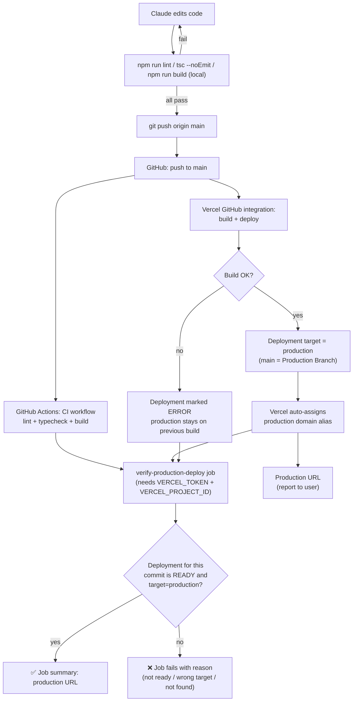

# Release pipeline — Cyber Sommelier

This describes how a code change goes from "edit" to "live on production",
what's automated, and what (if anything) still needs a human.

## TL;DR

> Push to `main` → CI runs lint/typecheck/build → Vercel builds and promotes
> production automatically → a verification job confirms the production
> deployment is healthy and reports the URL.

No PRs, manual merges, or manual "Promote to Production" clicks are part of
the normal flow.

## Current flow (as of this change)

## Target flow (fully automated — same as current, once one-time setup is done)

The "target" state is identical to the diagram above. The only gap between
"current" and "target" is the **one-time secret setup** described below —
once that's done, every push to `main` is fully verified with no manual
steps.

## What's automated

| Step | How |
|---|---|
| Lint / typecheck / build before pushing | Run locally by Claude before every commit |
| Lint / typecheck / build after pushing | `.github/workflows/ci.yml` → `build` job, on every push to `main` |
| Deploy to production | Vercel's GitHub App, triggered by push to `main` (Vercel's "Production Branch" setting) |
| Domain → latest deployment | Vercel auto-promotes the newest successful production-branch build and re-points the production domain alias at it |
| Detect build failures / wrong target / rollback drift | `.github/workflows/ci.yml` → `verify-production-deploy` job (needs secrets, see below) |
| Reporting the production URL | Printed in the GitHub Actions job summary by `verify-production-deploy` |

## What still requires a human — and why

These are **one-time** setup steps. Once done, no further manual action is
needed for normal feature pushes.

1. **Add `VERCEL_TOKEN` and `VERCEL_PROJECT_ID` as GitHub repo secrets**
   (Settings → Secrets and variables → Actions).
   *Why a human:* creating a Vercel API token requires logging into the
   Vercel dashboard (Account Settings → Tokens) — Claude has no Vercel
   credentials and this sandbox cannot reach `vercel.com` at all (network
   policy blocks it). Without these secrets, the `verify-production-deploy`
   job skips itself with a warning instead of failing the build.
   - `VERCEL_PROJECT_ID`: Project Settings → General → "Project ID".
   - `VERCEL_TEAM_ID` (optional): only needed if the project lives under a
     team (e.g. `0990997-afks-projects`) — Team Settings → "Team ID".
   - Use a token scoped to this one project if possible.

2. **Confirm Vercel's "Production Branch" is `main`** (Project Settings →
   Git). *Why a human:* this is a one-time dashboard toggle; Claude cannot
   open the Vercel dashboard from this sandbox to verify or change it.

3. **Confirm `ANTHROPIC_API_KEY` is set for the Production environment**
   (Project Settings → Environment Variables). *Why a human:* secret values
   can't be read back via API for verification, and this sandbox can't reach
   the Vercel dashboard to set them. Without it, the live site silently runs
   in deterministic fallback/demo mode (still works, just not AI-powered).

4. **Reviewing genuinely failed CI / deploys.** If `verify-production-deploy`
   fails (build error, Vercel outage, production branch misconfigured), the
   GitHub Actions run will explain why in its summary. Claude can read these
   logs and fix code issues, but can't fix Vercel **dashboard**
   misconfiguration (e.g. wrong Production Branch, deleted project) — that
   needs a human in the Vercel UI.

5. **Rotating/revoking any credentials shared in chat.** If a Vercel or
   GitHub token is ever pasted into the conversation, treat it as
   compromised and rotate it in the respective dashboard — Claude will flag
   this but can't rotate tokens itself.

## Everyday workflow (after one-time setup)

You describe a feature → Claude:
1. Implements it.
2. Runs lint/typecheck/build locally.
3. Commits and pushes to `main`.
4. Watches the GitHub Actions run (CI + `verify-production-deploy`).
5. Reports back: ✅/❌, and the production URL to test.

If `verify-production-deploy` reports a problem that's code-related, Claude
fixes it and repeats. If it's a Vercel dashboard setting, Claude tells you
exactly which setting to check (per the table above).
